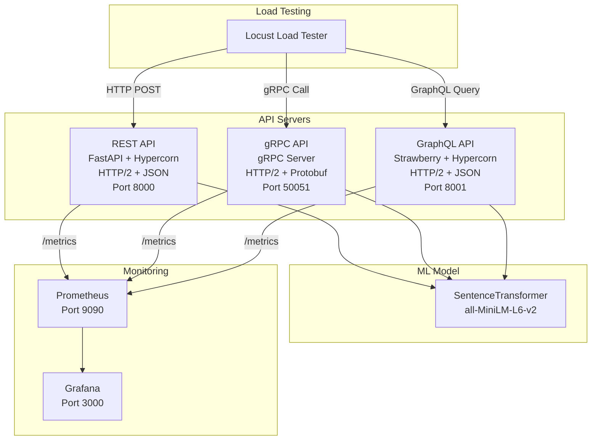

# ML Model Serving Protocol Comparison

A comprehensive benchmark comparing REST, gRPC, and GraphQL for serving machine learning models, with analysis of HTTP/1.1 vs HTTP/2 performance.

## Overview

This project implements the same text embedding service using three different API protocols:
- **REST API** (FastAPI + JSON)
- **gRPC API** (Protocol Buffers)
- **GraphQL API** (Strawberry + JSON)

All implementations use the same embedding model (SentenceTransformer) to ensure fair comparison.

## Goals

1. Compare protocol performance (REST vs gRPC vs GraphQL) with HTTP/2
2. Analyze HTTP/1.1 vs HTTP/2 impact per protocol
3. Measure latency (p50, p95, p99), throughput, and payload sizes
4. Provide data-driven recommendations for ML model serving

## Architecture



## Project Structure

```
ml-serving-comparison/
├── README.md
├── requirements.txt
├── docker-compose.yml
├── .gitignore
│
├── shared/
│   └── model.py                # Shared embedding model
│
├── rest_api/
│   ├── main.py
│   ├── Dockerfile
│   └── requirements.txt
│
├── grpc_api/
│   ├── embedding.proto
│   ├── server.py
│   ├── Dockerfile
│   └── requirements.txt
│
├── graphql_api/
│   ├── schema.py
│   ├── main.py
│   ├── Dockerfile
│   └── requirements.txt
│
├── load_tests/
│   ├── locustfile.py
│   └── test_scenarios.py
│
├── monitoring/
│   ├── prometheus.yml
│   └── grafana/
│       └── dashboards/
│
└── results/
    ├── data/                   # CSV results
    └── charts/                 # Generated visualizations
```

## Quick Start

### Prerequisites

- Python 3.9+
- Docker & Docker Compose
- 8GB RAM minimum

### Installation

1. Clone the repository:
```bash
git clone https://github.com/ranjanarajendran/ml-serving-comparison.git
cd ml-serving-comparison
```

2. Install dependencies:
```bash
python -m venv venv
source venv/bin/activate  # On Windows: venv\Scripts\activate
pip install -r requirements.txt
```

3. Start all services:
```bash
docker-compose up -d
```

4. Verify services are running:
```bash
# REST API
curl http://localhost:8000/health

# GraphQL API
curl http://localhost:8001/graphql

# Prometheus
open http://localhost:9090

# Grafana (admin/admin)
open http://localhost:3000
```

### Running Benchmarks

```bash
# Run load tests
locust -f load_tests/locustfile.py

# View results in Grafana
open http://localhost:3000
```

## Results (Coming Soon)

Performance comparison will be added after benchmarking is complete.

## Technology Stack

- **Python 3.9+**
- **FastAPI** - REST API framework
- **Hypercorn** - ASGI server with HTTP/2 support
- **gRPC** - High-performance RPC framework
- **Strawberry GraphQL** - Python GraphQL library
- **SentenceTransformers** - Text embedding model
- **Locust** - Load testing framework
- **Prometheus** - Metrics collection
- **Grafana** - Metrics visualization
- **Docker & Docker Compose** - Containerization

## License

MIT License

## Author

Ranjana Rajendran
- GitHub: [@ranjanarajendran](https://github.com/ranjanarajendran)
- Portfolio: [ranjanarajendran.github.io](https://ranjanarajendran.github.io/)
